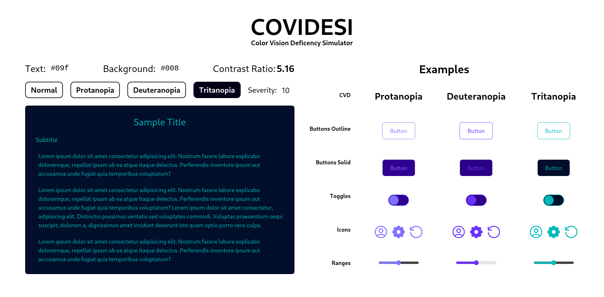

# COVIDESI - Color Vision Deficiency Simulator

#### Try it out [here](https://apacha01.github.io/covidesi)

I got interested in accessibility for webpages and the contrasts of colors of the text with the background, so i researched and i found out about all the different CVDs (Color Vision Deficiency) out there. I did find great pages like [this one](https://www.toptal.com/designers/colorfilter) that passes your webpage through the different filters to simulate color deficiency, however i couldn't find a simple page where i can input the colors i want and check the results. So this is it, a simple webpage to try out text/background color combinations and check how it would look like for people with CVD.

This simulator is based on the `A Physiologically-based Model for Simulation of Color Vision Deficiency` paper that i got from [this web page](https://www.inf.ufrgs.br/~oliveira/pubs_files/CVD_Simulation/CVD_Simulation.html). I think it's supposed to be one of the most accurate ones (models for simulating CVD), but if i'm wrong and you know about the subject, please feel free to raise an issue. You can also read [this](https://www.colourblindawareness.org/colour-blindness/types-of-colour-blindness/) great article that helped me understand better this topic.

Finally, this page also includes a small contrast checker that tells you wether it's AA or AAA compliant, with the calculation taken from [the w3 page on contrast](https://www.w3.org/TR/UNDERSTANDING-WCAG20/visual-audio-contrast-contrast.html#key-terms).

## The theory

People have what's called a coned cell in their eyes, there's three cone cells, one for each color in RGB (Red - Green - Blue). If you have all three cone cells in good state, then it's said that you have a __Trichromat__ vision (the normal vision), but when you have color blindness, one or more of this cone cells may not work or work partially, so you have an anomaly (Anomalous Trichromacy). In extreme cases where this don't work at all, you are have a __Dichromatic__ vision.

The paper talks about three CVDs:
* Protanopia: blind to red light
* Deuteranopia: blind to green light
* Tritanopia: blind to blue light

Each of these have different severity (like a scale), where if you have severity 1, it's almost like normal vision, but if it reaches 10, you are color blind for at least one color (it depends on your CVD). However, there's different names for complete vs partial blindness for each CVD:
* Protanopia is when severity is 10, from 1 to 9 it's called __Protanomaly__ and you are not color blind, but have reduced sensitivity to red light
* Deuteranopia is when severity is 10, from 1 to 9 it's called __Deuteranomaly__ and you are not color blind, but have reduced sensitivity to green light
* Tritanopia is when severity is 10, from 1 to 9 it's called __Tritanomaly__ and you are not color blind, but have reduced sensitivity to blue light

The paper goes from 0 to 10 where 0, in each and every case, is normal vision, but my page just skipped that.

There is also __Monochromatic__, also called __Achromatopsia__, vision, which is a specific eye condition in which people see in grey scale, but it is not covered in this page.

## The webapp

The web was design so it fits my screen perfectly in my laptop. I didn't put much effort into making it responsive so the best experience will come from PC and something with (or higher) dimensions of `1920x1080 pixels (508x285 millimeters)`. If you know the stack used and want to contribute, just make a pull request with the css adjusted so it's responsiveness is better.

### The stack
*  - The web framework for content-driven websites.
*  - JavaScript with syntax for types.
*  - A utility-first CSS framework for rapidly building custom designs.

## TODO

- [ ] Add a color generator to get the closest color combination that's accessible in case the two input colors don't have enough contrast.
- [ ] Add Monochromatic CVD, turns out it's not as simple as a `filter: grayscale(1)`.